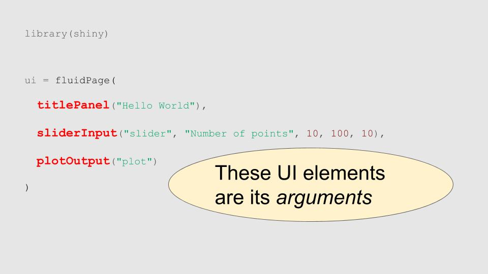

```{r setup, include=FALSE}
knitr::opts_chunk$set(echo = FALSE)
```

# Easy to write interactive <br> web apps powered by R

# Apps consist of user interface (UI) code and server code parts

# Apps are *reactive*, a kind of event-driven programming model

## Plan

- Cover basic app design and reactive ideas
- Explore recent RStudio shiny debugging features
- Build example apps together
- App-a-thon (build your own apps)

# Basic app design

## What is an app?

A user-interface (*ui*) object together with a *server* function

Either:

1. Store app UI and server code in ui.R, server.R files.
2. Supply them as arguments to the shinyApp function directly.


## Hello world example

```{r eval=FALSE, echo=TRUE}
library(shiny)

ui = fluidPage(
  titlePanel("Hello World"),
  sliderInput("slider", "Number of points", 10, 100, 10),
  plotOutput("plot")
)

server = function(input, output, session)
{
  output$plot = renderPlot({
    N = input$slider
    plot(rnorm(N), rnorm(N), pch=19, col=4)
  })
}

shinyApp(ui, server)
```

http://shiny.rstudio.com/reference/shiny/latest/

#


#


#


#


## Reactive programming

You too can write reactive functions. Shiny magically evaluates reactives only when they need to run. This makes program execution very efficient.

##
```{r eval=FALSE, echo=TRUE}
library(shiny)

ui = fluidPage(
  titlePanel("Hello World"),
  sliderInput("slider", "Number of points", 10, 100, 10),
  plotOutput("plot")
)

server = function(input, output, session)
{
  N = reactive({
    list(x=rnorm(input$slider), y=rnorm(input$slider)
  })     # NOTE! N is a **function**
    
  output$plot = renderPlot({
    plot(N()$x, N()$y, pch=19, col=4)
  })
}

shinyApp(ui, server)
```

#


# Interlude<br><br>Debugging and reactive network visualization

# Brewery planner<br><br>A not completely serious app example

## App idea

Explore beer/alcohol consumption by Ohio county.

## Data sources

Hard to find interesting publicly available data sets about Ohio :(. ButI did find these:

* Ohio county data  http://www2.census.gov/geo/docs/maps-data/data/gazetteer/counties_list_39.txt
* Medicaid assessment    http://grc.osu.edu/omas/datadownloads/ofhsoehspublicdatasets/

## Data prep

```{r eval=FALSE, echo=TRUE}
load(url("http://bwlewis.github.io/Feb2016_Cleveland_R_Meetup/counties.rdata"))
load(url("http://bwlewis.github.io/Feb2016_Cleveland_R_Meetup/ofhs2010_subset.rdata"))


drinking = aggregate(ofhs2010_subset[,c("drinking_rate", "binge")],
                     by=list(s9=ofhs2010_subset$s9), FUN=mean, na.rm=TRUE)

drinking$count = aggregate(ofhs2010_subset$s9, 
                           by=list(s9=ofhs2010_subset$s9), FUN=length)[,2]

drinking$adjusted = drinking$drinking_rate / drinking$count

data = merge(drinking, counties, by="s9")
```

## Shiny UI
```{r eval=FALSE, echo=TRUE}
library(shiny)
library(DT)
library(leaflet)

ui = fluidPage(
  title = "A particularly silly brewery planner",
  fluidRow(
    column(2, h3("A silly brewery planner"), 
           selectInput("select", label = h3("Variable"), 
                       choices = list("Population" = "POP10",
                                       "Drinking rate" = "drinking_rate",
                                       "Pop adjusted rate" = "adjusted",
                                       "Binge drinking rate" = "binge"))),
    column(10, leafletOutput("mymap", height=700))
  ),
  hr(),
  dataTableOutput("mytable")
)
```

## Shiny Server
```{r eval=FALSE, echo=TRUE}
server = function(input, output, session) {
  pal = reactive({
    i = floor(1 + 10 * data[, input$select] / max(data[, input$select]))
    substr(colorRampPalette(c("blue", "red"))(max(i))[i], 1, 7)
  })  # color, coverted to non-alpha hex RGB values for leaflet (the substr)
  rad = reactive({
    2e4 * data[, input$select] / max(data[, input$select])
  })  # radius
  
  output$mymap = renderLeaflet({
    map = addTiles(leaflet())
    map = setView(map, -83, 39.96, zoom = 7)
    addCircles(map, lat=data$INTPTLAT, lng=data$INTPTLONG, radius=rad(),
               popup=data$NAME, fillColor=pal(), fillOpacity=0.7, stroke=FALSE)
  })
  output$mytable = renderDataTable(data)
}
```

## Run it!
```{r eval=FALSE, echo=TRUE}
shinyApp(ui, server)
```

## Try writing your own simple apps (I'll help!)

Ideas

- Maybe you already have something you've worked on, that you can show?
- Pick an R example and app-ify it, some ideas:
    - Show qqplots sampled from Student's t distribution with varying degrees of freedom
    - Play around with clustering data("HouseVotes84", "mlbench")

Advanced: Why didn't I talk about observables? Ask me.

Have fun!